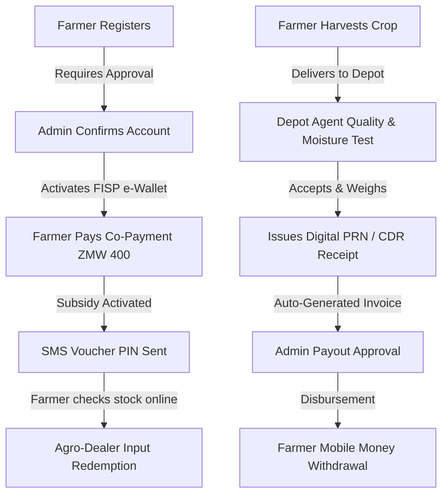

# FRA & FISP Digital Platform - System Process Analysis

This document outlines the operational processes for the **Food Reserve Agency (FRA)** and the **Farmer Input Support Programme (FISP)** in Zambia, detailing how physical procedures map to the digital e-system. It provides a complete status audit of the project features to identify what is fully integrated, what is mocked, and what remains to be built.

---

## 1. Physical vs. Digital E-System Flow

---

## 2. Stakeholder Process Breakdowns

### 🧑‍🌾 Farmer Workflow
1.  **Self-Registration**: Farmers self-register on their phone, inputting personal details, location coordinates, crop types, capturing a photo, and drawing a signature.
2.  **Account Verification**: Farmer waits for administrators to validate their credentials (NRC verification).
3.  **FISP Co-Payment**: Farmers pay their ZMW 400 contribution to unlock the government input subsidy.
4.  **Agro-Dealer Stock Lookup**: Farmer searches online for nearby agro-dealers to check who has the required seed or fertilizer compounds in stock.
5.  **Redemption & Pick-up**: Farmer visits the agro-dealer and uses their voucher PIN/QR code to redeem inputs.
6.  **Grain Delivery**: Farmer delivers crops to the depot and receives a digital Commodity Deposit Receipt (CDR).
7.  **Wallet Management**: Farmer checks their balance and requests a payout to MTN MoMo or Airtel Money.

### 👮 Field Agent / Depot Supervisor Workflow
1.  **Enrollment Assistance**: Manually registers farmers in the field who do not have smartphones (KYC, GPS capture, signature collection).
2.  **Grain Quality Control**: Inspects grain moisture content (threshold $\le$ 12.5% for maize) and grades the crop.
3.  **Intake Recording**: Weighs the crop, records intake weight against the farmer's verified NRC, and prints/generates a **Purchase Receipt Note (PRN)**.

### 🏪 Agro-Dealer Workflow
1.  **Voucher Authentication**: Inputs the farmer's NRC and e-voucher PIN code into the e-system.
2.  **Redemption & Stock Update**: Disburses fertilizer or seeds, decrementing store stock and generating a digital request for payout from the government.

### 🏢 Admin / FRA Coordinator Workflow
1.  **Farmer Verification**: Reviews self-registered farmer applications, photos, and signatures to approve accounts.
2.  **Logistics Tracking**: Coordinates shipments moving grain from collection points to central storage.
3.  **Payment Approvals**: Approves pending depot intake payments to release funds to farmers' digital wallets.
4.  **Fraud Auditing**: Monitors alerts for duplicate NRC registers, double-dipping, and suspicious grades.

---

## 3. Feature Audit & Codebase Integration Status

The table below outlines the implementation status across the **Frontend** and **Backend** codebases:

| Feature Name | Process Phase | Frontend Wired? | Backend Wired? | Codebase References | Details & Integration Gaps |
| :--- | :--- | :--- | :--- | :--- | :--- |
| **Farmer Self-Registration** | Onboarding | [x] Yes | [x] Yes | [Registration.tsx (Self)](file:///c:/FOR%20EDWARD/SNAPFING/agritech-smart-service/client/pages/shared/auth/Registration.tsx) [registration.api.ts](file:///c:/FOR%20EDWARD/SNAPFING/agritech-smart-service/client/services/registration.api.ts) [server/index.ts#L152](file:///c:/FOR%20EDWARD/SNAPFING/agritech-smart-service/server/index.ts#L152) | Fully wired. Submits multi-step KYC data, photo, signature, and district code. |
| **Admin Farmer Account Verification** | Onboarding | [ ] No | [ ] No | [AdminDashboard.tsx](file:///c:/FOR%20EDWARD/SNAPFING/agritech-smart-service/client/pages/shared/dashboard/AdminDashboard.tsx) | **Missing.** Farmers are auto-verified upon registration. No administrative review screen exists. |
| **FISP Eligibility Screening** | Onboarding | [x] Yes | [x] Yes | [Registration.tsx (Agent)](file:///c:/FOR%20EDWARD/SNAPFING/agritech-smart-service/client/pages/agent/registration/Registration.tsx#L99-L123) | Checks for duplicate NRCs and minimum land size ($0.5\text{ Ha}$) before allowing agent submission. |
| **Farmers Check Stocked Agro-Dealers** | FISP | [ ] Mocked | [ ] No | [Vouchers.tsx](file:///c:/FOR%20EDWARD/SNAPFING/agritech-smart-service/client/pages/farmer/vouchers/Vouchers.tsx#L28-L41) | **Frontend only.** Dealer map and inventory list use local static mock arrays. No backend DB table or API endpoint exists. |
| **FISP Co-Payment Processing** | FISP | [ ] No | [ ] No | [Wallet.tsx](file:///c:/FOR%20EDWARD/SNAPFING/agritech-smart-service/client/pages/farmer/wallet/Wallet.tsx) | **Missing.** Vouchers are activated automatically. No pathway exists for farmers to deposit their ZMW 400 contribution. |
| **Voucher Redemption** | FISP | [x] Yes | [x] Yes | [RedemptionPortal.tsx](file:///c:/FOR%20EDWARD/SNAPFING/agritech-smart-service/client/pages/agent/redemption/RedemptionPortal.tsx) [server/postgres.ts#L417](file:///c:/FOR%20EDWARD/SNAPFING/agritech-smart-service/server/postgres.ts#L417) | Fully wired. Agent enters PIN; backend marks the voucher as `REDEEMED` and adds redemption log. |
| **Depot Grain Intake Weight Recording** | Harvest | [x] Yes | [x] Yes | [GrainRecording.tsx](file:///c:/FOR%20EDWARD/SNAPFING/agritech-smart-service/client/pages/shared/dashboard/components/GrainRecording.tsx) [production.service.ts](file:///c:/FOR%20EDWARD/SNAPFING/agritech-smart-service/server/production.service.ts) | Fully wired. Submits delivery weight, inserts records, and calculates crop value. |
| **Moisture Content Inspection** | Harvest | [ ] Mocked | [ ] No | [GrainRecording.tsx#L69-L74](file:///c:/FOR%20EDWARD/SNAPFING/agritech-smart-service/client/pages/shared/dashboard/components/GrainRecording.tsx#L69-L74) [postgres.ts#L110](file:///c:/FOR%20EDWARD/SNAPFING/agritech-smart-service/server/postgres.ts#L110) | **Gaped.** Moisture content is inputted on the frontend but discarded on submission. Backend table has no storage column. |
| **PRN / CDR Receipt Generation** | Harvest | [x] Yes | [ ] No | [GrainRecording.tsx#L197-L239](file:///c:/FOR%20EDWARD/SNAPFING/agritech-smart-service/client/pages/shared/dashboard/components/GrainRecording.tsx#L197-L239) | **Frontend only.** Receipt card is rendered locally on submission success, but cannot be fetched or printed later by the farmer. |
| **Wallet Payout/Withdrawal** | Finance | [x] Yes | [x] Yes | [Wallet.tsx](file:///c:/FOR%20EDWARD/SNAPFING/agritech-smart-service/client/pages/farmer/wallet/Wallet.tsx) [server/index.ts#L166](file:///c:/FOR%20EDWARD/SNAPFING/agritech-smart-service/server/index.ts#L166) | Fully wired. Performs balance verification and triggers MTN/Airtel gateway simulation. |
| **Pending Payout Approval** | Finance | [x] Yes | [x] Yes | [Payments.tsx](file:///c:/FOR%20EDWARD/SNAPFING/agritech-smart-service/client/pages/admin/payments/Payments.tsx) [postgres.ts#L429](file:///c:/FOR%20EDWARD/SNAPFING/agritech-smart-service/server/postgres.ts#L429) | Fully wired. Admin approves all pending payments to inject funds into farmer wallets. |
| **Logistics Tracking** | Logistics | [x] Yes | [x] Yes | [Logistics.tsx](file:///c:/FOR%20EDWARD/SNAPFING/agritech-smart-service/client/pages/admin/logistics/Logistics.tsx) [server/index.ts#L237](file:///c:/FOR%20EDWARD/SNAPFING/agritech-smart-service/server/index.ts#L237) | Fully wired. Reads shipments and transit data from the database. |
| **Fraud & Duplicate Detection** | Audit | [x] Yes | [ ] No | [AdminDashboard.tsx#L313-L343](file:///c:/FOR%20EDWARD/SNAPFING/agritech-smart-service/client/pages/shared/dashboard/AdminDashboard.tsx#L313-L343) | **Frontend only.** Fraud hotspots on the Admin dashboard read from static mock alerts. No active backend anomaly detector is implemented. |

---

## 4. Prioritized Recommendations for the Team

Based on the audit, the team should prioritize the following integrations:
1.  **Wire Moisture Content into Delivery Records**: Add `moisture` and `grade` columns to the database schema in [postgres.ts](file:///c:/FOR%20EDWARD/SNAPFING/agritech-smart-service/server/postgres.ts), validate moisture levels in [production.service.ts](file:///c:/FOR%20EDWARD/SNAPFING/agritech-smart-service/server/production.service.ts) ($\le 12.5\%$), and submit these parameters from [GrainRecording.tsx](file:///c:/FOR%20EDWARD/SNAPFING/agritech-smart-service/client/pages/shared/dashboard/components/GrainRecording.tsx).
2.  **Build Admin Farmer Verification Screen**: Implement an account validation table in [AdminDashboard.tsx](file:///c:/FOR%20EDWARD/SNAPFING/agritech-smart-service/client/pages/shared/dashboard/AdminDashboard.tsx) allowing admins to review registration documents and toggle farmer status from `PENDING` to `VERIFIED`.
3.  **Establish Agro-Dealer Stock Table**: Add a database model for Agro-Dealers and their inventory, enabling the frontend e-map in [Vouchers.tsx](file:///c:/FOR%20EDWARD/SNAPFING/agritech-smart-service/client/pages/farmer/vouchers/Vouchers.tsx) to fetch live stock rather than hardcoded mock data.
4.  **Implement ZMW 400 Co-Payment Gateway**: Add a simulated credit/debit gateway in the farmer's wallet view to activate pending FISP vouchers.
